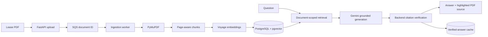

# Know Your Lease

**A RAG application for lease PDF analysis, grounded answers, and source-linked citations that can be verified in the original document.**

Know Your Lease turns a digital lease into a reusable question-answering workspace. Upload once, index once, then ask lease-specific questions and inspect each answer against backend-verified excerpts with direct PDF page navigation and highlighting.

<p align="center">
  
</p>

## Technical Highlights

- Legal-domain embeddings with Voyage AI `voyage-law-2` and PostgreSQL/pgvector
- Page-aware extraction, chunking, retrieval, and citation provenance
- Structured, evidence-bound generation with Gemini
- Backend verification of model-selected source IDs and supporting quotes
- Source cards linked to PDF page navigation and text-layer highlighting
- Persistent exact-question cache containing only previously verified answers
- SQS queue boundary with a standalone ingestion worker for production mode
- Upload-once, index-once document reuse across browser sessions
- Retrieval evaluation with Hit@1, Hit@3, Hit@5, and first-relevant-rank metrics

## How It Works

1. Upload a digital PDF lease; the API stores it under a generated UUID key.
2. In SQS mode, the API queues the document UUID and a standalone worker starts ingestion.
3. PyMuPDF extracts and normalizes text while retaining page provenance.
4. Conservative overlapping chunks are embedded once and stored in pgvector.
5. Each question is embedded and searched only against the requested document.
6. Gemini receives at most five retrieved excerpts as untrusted evidence.
7. The backend validates source IDs, quotes, page metadata, and abstention behavior.
8. The UI displays the grounded answer and opens the supporting page in the original PDF.
9. Repeating the same normalized question reuses its verified cached answer without another provider call.

## Retrieval Evaluation

The production retrieval path was evaluated independently from answer generation using **24 supported questions** and **3 unsupported controls**.

| Metric | Result |
| --- | ---: |
| **Hit@1** | **91.7%** |
| **Hit@3** | **95.8%** |
| **Hit@5** | **100.0%** |
| **Average first relevant rank** | **1.17** |

Every labeled source appeared in the final top five. Vector-only retrieval was retained because the measured results did not justify adding hybrid search or reranking complexity.

## Architecture



### Ingestion

PDFs are validated before storage. In SQS mode, the API commits a `queued` document and publishes only its UUID; the standalone worker then reuses the existing ingestion service. Text is normalized without paraphrasing and split into page-aware chunks. Voyage document embeddings use asymmetric document mode and are persisted as 1,024-dimensional vectors. Chunk persistence is all-or-nothing: a document becomes `ready` only after extraction, chunking, and all embeddings succeed.

### Retrieval and generation

Exact pgvector cosine search filters by `document_id` before ranking. The backend retrieves 10 candidates, diversifies them to at most five evidence chunks, and sends only those excerpts to Gemini in a structured grounded-generation request.

### Citation verification and caching

Gemini never supplies trusted page numbers. The backend maps returned source IDs to retrieved database rows, verifies generated quotes against their chunks, derives citation metadata itself, and safely abstains when output is unsupported. Only verified answers enter the document-scoped exact-question cache; paraphrases do not collide automatically.

## Tech Stack

| Layer | Technology |
| --- | --- |
| Frontend | Next.js 16, React 19, TypeScript, Tailwind CSS, React-PDF |
| Backend | FastAPI, Pydantic, SQLAlchemy, Alembic |
| PDF processing | PyMuPDF, page-preserving normalization, local chunker |
| Embeddings | Voyage AI `voyage-law-2` |
| Retrieval | PostgreSQL, pgvector, exact cosine search |
| Generation | Gemini structured JSON via the Google GenAI SDK |
| Persistence | PostgreSQL, local/S3 UUID-owned PDF storage, verified-answer cache |
| Deployment foundation | Vercel/Railway local-inline path; AWS-ready S3/SQS API-worker boundaries |

The project intentionally avoids LangChain, LlamaIndex, a second vector database, semantic caching, and an additional LLM verification call. Those components are deferred until evaluation demonstrates a concrete need.

## Grounding, Safety, and Privacy

- Lease text is treated as untrusted data and cannot override generation instructions.
- Answers are restricted to retrieved lease evidence; unsupported questions abstain.
- Retrieval, citations, and cache rows remain strictly scoped by `document_id`.
- Unknown model source IDs reject the response; page and chunk metadata remain backend-owned.
- PDFs use generated UUID storage keys in local or private S3 storage; APIs expose neither paths nor bucket details.
- Provider/database secrets use masked configuration, and local `.env` files are ignored.
- Production configuration rejects wildcard CORS, non-HTTPS frontend origins, enabled debug routes, missing provider keys, unsafe local paths, and incomplete S3 settings.
- Every document route passes through a centralized access-policy seam for future ownership enforcement.

This is currently a single-user application. Browser `localStorage` remembers an active document UUID for convenience, not authorization; sensitive multi-user deployment requires authenticated document ownership.

## Repository Structure

```text
frontend/                       Next.js upload, Q&A, citations, and PDF viewer
backend/app/api/                FastAPI routes and document access boundary
backend/app/services/           Storage, ingestion, retrieval, generation, and cache
backend/app/workers/            Standalone SQS ingestion worker
backend/app/models/             Documents, chunks, and grounded-answer cache
backend/alembic/                Additive PostgreSQL migrations
backend/evaluation/             Retrieval labels and evaluation tooling
backend/tests/                  Offline provider-mocked regression suite
docs/                           Architecture, decisions, evaluation, and deployment
railway.toml                    Railway build, migration, startup, and health config
backend/Dockerfile              Production-oriented API/migration runtime image
```

## Local Setup

Prerequisites: Python 3.13, Node.js 20.19+/22.13+/24+, Docker, a Voyage API key, and a Gemini API key.

```bash
cp backend/.env.example backend/.env
cp frontend/.env.example frontend/.env.local

python3 -m venv backend/.venv
source backend/.venv/bin/activate
python -m pip install -r backend/requirements-dev.txt

cd frontend
npm install
cd ..
```

Add the provider keys to `backend/.env`, then start PostgreSQL, migrate, and run the API:

```bash
docker compose up -d database
cd backend
source .venv/bin/activate
alembic upgrade head
uvicorn app.main:app --reload --port 8000
```

In another terminal:

```bash
cd frontend
npm run dev
```

Open `http://localhost:3000`. Local PDFs default to `backend/storage/uploads/`; set `PDF_STORAGE_DIR` to override the storage root.
S3 and SQS are optional and never required for inline local development. See [document storage](docs/document-storage.md) and the [ingestion worker](docs/ingestion-worker.md) for backend selection, queue behavior, worker startup, and IAM boundaries.

### Containerized backend

The production-oriented backend image runs Uvicorn as a non-root user, reads all configuration at runtime, includes Alembic migrations, and keeps application startup separate from schema migration:

```bash
docker compose up -d database
docker compose build api
docker compose run --rm api alembic upgrade head
docker compose up -d api
curl http://localhost:8000/health
```

This Compose path is optional; the native reload workflow above remains unchanged. See the [backend container runtime](docs/container-runtime.md) for direct build/run commands, required production variables, health semantics, storage permissions, migration ordering, and future ECR/ECS reuse.

## API Surface

- `GET /health` — service health
- `POST /documents` — validate and persist a PDF, then schedule inline or enqueue SQS ingestion
- `GET /documents` — list safe document metadata
- `GET /documents/{id}` — get processing status and metadata
- `GET /documents/{id}/pdf` — stream the original PDF
- `POST /documents/{id}/questions` — return a grounded answer and verified citations
- `GET /documents/{id}/chunks` — development-only chunk inspection
- `POST /documents/{id}/retrieve` — development-only retrieval diagnostics

Debug endpoints return 404 when disabled and cannot be enabled in production configuration.

## Deployment

The repository includes supported deployment configuration but does **not** claim a currently hosted deployment:

- Vercel project rooted at `frontend/`
- Railway API service rooted at `backend/`
- Railway PostgreSQL with pgvector
- Railway persistent volume mounted at `/data/documents`
- Alembic pre-deploy migrations, Uvicorn on Railway's assigned `PORT`, and `/health` gating

See the [deployment runbook](docs/deployment.md) for exact settings and environment variables.
The Phase 1 Docker image is a reusable runtime foundation only; no ECR or ECS deployment is implemented yet.
The API supports private S3 document storage and SQS-backed ingestion, but the repository does not provision buckets, queues, IAM roles, or an AWS runtime.

## Testing

```bash
cd backend
source .venv/bin/activate
pytest
ruff check .

cd ../frontend
npm run lint
npm run typecheck
npm run build

cd ..
git diff --check
```

Automated tests mock Voyage and Gemini; they do not make provider calls or re-index a lease.

## Current Limitations

- No authentication or user/document ownership enforcement
- Phase 3A queue processing has at-least-once delivery but not yet idempotency, application retry classification, DLQ/poison-message hardening, or distributed locks
- Single-process provider rate coordination
- No provisioned S3 bucket, lifecycle/retention policy, backup policy, or AWS deployment infrastructure
- No OCR, malware scanning, or encrypted retention workflow
- No calibrated retrieval threshold, reranker, or hybrid lexical retrieval
- No chat history or follow-up question rewriting
- Best-effort text-layer highlighting rather than coordinate-level highlights

Further detail: [architecture](docs/architecture.md), [document storage](docs/document-storage.md), [RAG decisions](docs/rag-decisions.md), [retrieval evaluation](docs/retrieval-evaluation.md), and [production hardening](docs/production-hardening.md).
