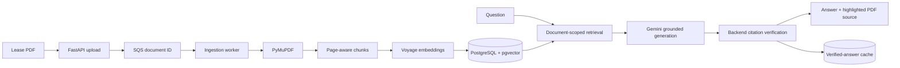

# Know Your Lease

**A RAG application for lease PDF analysis, grounded answers, and source-linked citations that can be verified in the original document.**

Know Your Lease turns a digital lease into a reusable question-answering workspace. Upload once, index once, then ask lease-specific questions and inspect each answer against backend-verified excerpts with direct PDF page navigation and highlighting.

<p align="center">
  
</p>

## Technical Highlights

- Cognito-backed authentication with per-document ownership enforced at a single access boundary
- Legal-domain embeddings with Voyage AI `voyage-law-2` and PostgreSQL/pgvector
- Page-aware extraction, chunking, retrieval, and citation provenance
- Structured, evidence-bound generation with Gemini
- Backend verification of model-selected source IDs and supporting quotes
- Source cards linked to PDF page navigation and text-layer highlighting
- Persistent exact-question cache containing only previously verified answers
- SQS queue boundary with a standalone ingestion worker for production mode
- Upload-once, index-once document reuse across browser sessions
- Retrieval evaluation with Hit@1, Hit@3, Hit@5, and first-relevant-rank metrics

## How It Works

1. Upload a digital PDF lease; the API stores it under a generated UUID key.
2. In SQS mode, the API queues the document UUID and a standalone worker starts ingestion.
3. PyMuPDF extracts and normalizes text while retaining page provenance.
4. Conservative overlapping chunks are embedded once and stored in pgvector.
5. Each question is embedded and searched only against the requested document.
6. Gemini receives at most five retrieved excerpts as untrusted evidence.
7. The backend validates source IDs, quotes, page metadata, and abstention behavior.
8. The UI displays the grounded answer and opens the supporting page in the original PDF.
9. Repeating the same normalized question reuses its verified cached answer without another provider call.

## Retrieval Evaluation

The production retrieval path was evaluated independently from answer generation using **24 supported questions** and **3 unsupported controls**.

| Metric | Result |
| --- | ---: |
| **Hit@1** | **91.7%** |
| **Hit@3** | **95.8%** |
| **Hit@5** | **100.0%** |
| **Average first relevant rank** | **1.17** |

Every labeled source appeared in the final top five. Vector-only retrieval was retained because the measured results did not justify adding hybrid search or reranking complexity.

## Architecture



### Authentication and ownership

Every document-scoped route requires an authenticated user: a verified Cognito access token (`AUTH_MODE=cognito`) or a fixed local-development user (`AUTH_MODE=disabled`, the local/test default). A single access boundary (`document_access.py`) resolves a document only when it is owned by the current user; unowned or another user's document returns 404, never 403, so a document UUID cannot be used to probe for someone else's lease. See [docs/authentication.md](docs/authentication.md) for the full design — this repository implements the flow in code but does not provision a live Cognito user pool.

### Ingestion

PDFs are validated before storage. In SQS mode, the API commits a `queued` document and publishes only its UUID and ingestion version; the standalone worker then reuses the existing ingestion service. Document-level version/attempt checks make duplicate and stale delivery safe. Text is normalized without paraphrasing and split into page-aware chunks. Voyage document embeddings use asymmetric document mode and are persisted as 1,024-dimensional vectors. Chunk replacement, cache invalidation, and the `ready` transition commit atomically after all embeddings succeed.

### Retrieval and generation

Exact pgvector cosine search filters by `document_id` before ranking. The backend retrieves 10 candidates, diversifies them to at most five evidence chunks, and sends only those excerpts to Gemini in a structured grounded-generation request.

### Citation verification and caching

Gemini never supplies trusted page numbers. The backend maps returned source IDs to retrieved database rows, verifies generated quotes against their chunks, derives citation metadata itself, and safely abstains when output is unsupported. Only verified answers enter the document-scoped exact-question cache; paraphrases do not collide automatically.

## Tech Stack

| Layer | Technology |
| --- | --- |
| Frontend | Next.js 16, React 19, TypeScript, Tailwind CSS, React-PDF |
| Backend | FastAPI, Pydantic, SQLAlchemy, Alembic |
| Authentication | Amazon Cognito (Hosted UI, PKCE), PyJWT JWKS verification |
| PDF processing | PyMuPDF, page-preserving normalization, local chunker |
| Embeddings | Voyage AI `voyage-law-2` |
| Retrieval | PostgreSQL, pgvector, exact cosine search |
| Generation | Gemini structured JSON via the Google GenAI SDK |
| Persistence | PostgreSQL, local/S3 UUID-owned PDF storage, verified-answer cache |
| Deployment foundation | Vercel plus a prepared AWS ECS/Fargate API-worker-migration boundary |

The project intentionally avoids LangChain, LlamaIndex, a second vector database, semantic caching, and an additional LLM verification call. Those components are deferred until evaluation demonstrates a concrete need.

## Grounding, Safety, and Privacy

- Lease text is treated as untrusted data and cannot override generation instructions.
- Answers are restricted to retrieved lease evidence; unsupported questions abstain.
- Retrieval, citations, and cache rows remain strictly scoped by `document_id`.
- Unknown model source IDs reject the response; page and chunk metadata remain backend-owned.
- PDFs use generated UUID storage keys in local or private S3 storage; APIs expose neither paths nor bucket details.
- Provider/database secrets use masked configuration, and local `.env` files are ignored.
- API production configuration requires S3, SQS, Cognito, an exact HTTPS frontend origin, both provider keys, and disabled debug routes. Worker and migration validation are narrower so those tasks do not receive API-only configuration or secrets.
- Every document route passes through one centralized access seam that enforces per-user document ownership; unowned/another user's document returns 404, never 403.

Every document belongs to exactly one authenticated user. Browser `localStorage` remembers an active document UUID for convenience only, never as authorization — the backend re-checks ownership on every request. This repository implements Cognito verification and ownership enforcement in code but does not provision or run a live Cognito user pool; see [docs/authentication.md](docs/authentication.md).

## Repository Structure

```text
frontend/                       Next.js upload, Q&A, citations, auth, and PDF viewer
backend/app/api/                FastAPI routes, auth dependencies, and document access boundary
backend/app/core/auth.py        Cognito JWT/JWKS verification
backend/app/services/           Storage, ingestion, retrieval, generation, and cache
backend/app/workers/            Standalone SQS ingestion worker
backend/app/models/             Users, documents (owner-scoped), chunks, and grounded-answer cache
backend/alembic/                Additive PostgreSQL migrations
backend/scripts/                Retrieval evaluation and local-development backfill tooling
backend/evaluation/             Retrieval labels and evaluation tooling
backend/tests/                  Offline provider-mocked regression suite
docs/                           Architecture, decisions, evaluation, deployment, and auth
railway.toml                    Retained legacy Railway runtime configuration
backend/Dockerfile              Shared API, worker, and migration runtime image
```

## Local Setup

Prerequisites: Python 3.13, Node.js 20.19+/22.13+/24+, Docker, a Voyage API key, and a Gemini API key.

```bash
cp backend/.env.example backend/.env
cp frontend/.env.example frontend/.env.local

python3 -m venv backend/.venv
source backend/.venv/bin/activate
python -m pip install -r backend/requirements-dev.txt

cd frontend
npm install
cd ..
```

Add the provider keys to `backend/.env`, then start PostgreSQL, migrate, and run the API:

```bash
docker compose up -d database
cd backend
source .venv/bin/activate
alembic upgrade head
uvicorn app.main:app --reload --port 8000
```

In another terminal:

```bash
cd frontend
npm run dev
```

Open `http://localhost:3000`. Local PDFs default to `backend/storage/uploads/`; set `PDF_STORAGE_DIR` to override the storage root.
S3 and SQS are optional and never required for inline local development. See [document storage](docs/document-storage.md) and the [ingestion worker](docs/ingestion-worker.md) for backend selection, queue behavior, worker startup, and IAM boundaries.

Local development needs no Cognito setup: `AUTH_MODE` defaults to `disabled`, which resolves every request to one fixed local user with no sign-in screen. Existing documents created before Phase 4 have no owner and are invisible to that user until backfilled once:

```bash
cd backend
source .venv/bin/activate
python scripts/backfill_document_owners.py
```

See [docs/authentication.md](docs/authentication.md) for the full Cognito flow, JWT verification, and what production requires.

### Containerized backend

The production-oriented backend image runs Uvicorn as a non-root user, reads all configuration at runtime, includes the worker and Alembic migrations, and keeps application startup separate from schema migration:

```bash
docker compose up -d database
docker compose build api
docker compose run --rm api alembic upgrade head
docker compose up -d api
curl http://localhost:8000/health
```

This Compose path is optional; the native reload workflow above remains unchanged. The same image can run the API default command, `python -m app.workers.ingestion`, or `alembic upgrade head`. See the [backend container runtime](docs/container-runtime.md) and [AWS deployment preparation](docs/aws-deployment.md) for workload-specific configuration and command behavior.

## API Surface

- `GET /health` — service health; the only route that requires no `Authorization` header
- `POST /documents` — validate and persist a PDF under the authenticated user, then schedule inline or enqueue SQS ingestion
- `GET /documents` — list the authenticated user's own document metadata
- `GET /documents/{id}` — get processing status and metadata for an owned document
- `GET /documents/{id}/pdf` — stream the original PDF for an owned document
- `POST /documents/{id}/questions` — return a grounded answer and verified citations for an owned document
- `GET /documents/{id}/chunks` — development-only chunk inspection (owned document + debug enabled)
- `POST /documents/{id}/retrieve` — development-only retrieval diagnostics (owned document + debug enabled)

All routes other than `/health` require `Authorization: Bearer <token>` when `AUTH_MODE=cognito` (local development's `AUTH_MODE=disabled` needs none). A document that does not exist and one owned by another user both return 404, never 403. Debug endpoints return 404 when disabled and cannot be enabled in production configuration.

## Deployment

Phase 6A prepares, but does not provision, the approved production target: a Vercel frontend, Cognito PKCE login, an HTTPS ALB, separate ECS/Fargate API and worker services, a one-off migration task, RDS PostgreSQL with pgvector, private S3 storage, SQS with a DLQ, ECR, IAM task roles, and Secrets Manager in `ca-central-1`.

The API, worker, and migration task use the same Docker image with workload-specific validation and least-secret configuration. See the [deployment overview](docs/deployment.md) and [AWS deployment preparation](docs/aws-deployment.md) for the exact configuration map. No AWS resources or hosted deployment currently exist; Phase 6B provisioning remains pending.

## Testing

```bash
cd backend
source .venv/bin/activate
pytest
ruff check .

cd ../frontend
npm run lint
npm run typecheck
npm test
npm run build

cd ..
git diff --check
```

Automated tests mock Voyage and Gemini; they do not make provider calls or re-index a lease.

## Continuous Integration

GitHub Actions runs one four-job CI workflow for pull requests targeting `main`,
pushes to `main`, and manual runs. The stable checks are `Backend`, `Frontend`,
`Database/Migrations`, and `Docker Build`. They validate dependency integrity,
Ruff, pytest, frontend lint/type/tests/build, the single-head Alembic graph and a
clean upgrade on PostgreSQL 18 with pgvector, and a cached `linux/amd64` build of
the production backend/worker image.

CI uses only deterministic local values and existing mocks; it needs no AWS,
Cognito, Voyage, Gemini, or production database secrets. The Docker image is
built but never pushed. Configure the four check names above as required checks
in the `main` branch ruleset after the workflow has run once. This is CI only;
continuous delivery is not implemented. See [continuous integration](docs/continuous-integration.md)
for the job design, migration policy, local commands, and branch-protection steps.

## Current Limitations

- Cognito authentication and per-document ownership are implemented in code, but this repository does not provision or run a live Cognito user pool
- Access tokens are stored in browser `localStorage`, which is readable by a successful XSS; a backend-for-frontend with httpOnly cookies would remove that exposure but is out of this phase's scope
- SQS remains at-least-once: application processing is idempotent, but AWS queue/DLQ provisioning, automated replay, visibility heartbeats, and cross-process provider rate coordination remain operational work
- No re-ingestion endpoint or version-bump producer: every document is created at ingestion version 1, and the version/attempt machinery that guards duplicate/stale delivery has no caller that requests a later version yet
- Single-process provider rate coordination
- No provisioned S3 bucket, lifecycle/retention policy, backup policy, or AWS deployment infrastructure
- No OCR, malware scanning, or encrypted retention workflow
- No calibrated retrieval threshold, reranker, or hybrid lexical retrieval
- No chat history or follow-up question rewriting
- Best-effort text-layer highlighting rather than coordinate-level highlights

Further detail: [architecture](docs/architecture.md), [AWS deployment preparation](docs/aws-deployment.md), [authentication](docs/authentication.md), [document storage](docs/document-storage.md), [RAG decisions](docs/rag-decisions.md), [retrieval evaluation](docs/retrieval-evaluation.md), and [production hardening](docs/production-hardening.md).
