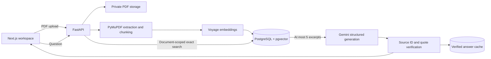

# Know Your Lease

Know Your Lease turns a lease PDF into a source-grounded question-answering workspace. A user uploads once, waits for page-aware indexing, then asks questions and inspects concise verified citations directly in the original PDF.

The project is deliberately evidence-bound: Gemini receives only retrieved lease excerpts, model source IDs are validated, page metadata comes from PostgreSQL, and model quotes must occur in the cited chunk. Unsupported answers abstain instead of silently falling back to outside legal knowledge.

## Product workflow

1. Upload a digital PDF lease.
2. Extract and normalize page-aware text without paraphrasing it.
3. Build conservative overlapping chunks and embed them with `voyage-law-2`.
4. Store document metadata, chunks, and 1,024-dimensional vectors in PostgreSQL + pgvector.
5. Retrieve document-scoped evidence with exact cosine search.
6. Generate a structured grounded answer with Gemini.
7. Verify citations in backend code and navigate to their PDF pages.
8. Reuse verified answers for repeat exact-normalized questions without another provider call.



## Architecture and stack

- **Frontend:** Next.js 16, React 19, TypeScript, Tailwind CSS, React-PDF
- **Backend:** FastAPI, Pydantic, SQLAlchemy, Alembic
- **Extraction:** PyMuPDF with page-preserving normalization
- **Embeddings:** Voyage AI `voyage-law-2`, asymmetric document/query modes
- **Retrieval:** exact pgvector cosine search, 10 candidates diversified to at most 5
- **Generation:** Gemini structured JSON through the official Google GenAI SDK
- **Persistence:** PostgreSQL + pgvector, UUID-owned PDF storage, persistent verified-answer cache
- **Deployment target:** Vercel frontend; Railway API, pgvector PostgreSQL, and persistent volume

The application does not use LangChain, LlamaIndex, a second vector database, semantic caching, or an extra LLM verification call. Those additions are deferred until evaluation demonstrates a concrete need.

## Retrieval evaluation

The production retrieval path was evaluated independently from generation against 24 supported questions and 3 unsupported controls on a representative 34-page lease with 50 indexed chunks.

| Metric | Result |
| --- | ---: |
| Hit@1 | 91.7% |
| Hit@3 | 95.8% |
| Hit@5 | 100.0% |
| Average first relevant rank | 1.17 |

Every labeled source appeared in the final top five, so the measured baseline remained vector-only without benchmark-driven reranking or hybrid search. The private evaluation lease is not part of this repository.

## Grounding, privacy, and hardening

- Retrieval and cache access are strictly scoped by `document_id`.
- Every document API route passes through one access-policy seam for future ownership enforcement.
- Questions and lease excerpts are JSON-encoded untrusted data separated from system instructions.
- Unknown model source IDs reject the response; source-less output becomes a fixed abstention.
- Citation page/chunk metadata is backend-owned, and model quotes require normalized containment.
- PDFs use generated UUID keys outside frontend public assets; internal paths never enter API responses.
- Provider/database secrets are masked configuration and `.env` files are ignored.
- Production rejects wildcard CORS, loopback/non-HTTPS frontend origins, enabled debug routes, missing provider configuration, and public frontend PDF storage.
- Exact-question cache hits skip both Voyage query embedding and Gemini generation; paraphrases never collide automatically.

This remains a single-user portfolio application. Browser `localStorage` remembers the active UUID for convenience but is not authorization. Do not expose sensitive leases to untrusted users until authenticated document ownership is implemented.

## Repository layout

```text
frontend/                       Next.js upload, Q&A, citations, and PDF viewer
backend/app/api/                FastAPI routes and centralized document access seam
backend/app/services/           Storage, ingestion, retrieval, generation, and cache
backend/app/models/             Documents, chunks, and grounded-answer cache
backend/alembic/                Additive production database migrations
backend/evaluation/             Question labels only; no private lease text
backend/tests/                  Offline provider-mocked regression suite
docs/                           Architecture, decisions, evaluation, and deployment
railway.toml                    Railway build/deploy/health configuration
```

## Local setup

Prerequisites: Python 3.13, Node.js 20.19+/22.13+/24+, Docker, a Voyage API key, and a Gemini API key.

```bash
cp backend/.env.example backend/.env
cp frontend/.env.example frontend/.env.local

python3 -m venv backend/.venv
source backend/.venv/bin/activate
python -m pip install -r backend/requirements-dev.txt

cd frontend
npm install
cd ..
```

Add your provider keys to `backend/.env`, then start PostgreSQL and apply the additive migrations:

```bash
docker compose up -d database
cd backend
source .venv/bin/activate
alembic upgrade head
uvicorn app.main:app --reload --port 8000
```

In another terminal:

```bash
cd frontend
npm run dev
```

Open `http://localhost:3000`. Local PDFs default to `backend/storage/uploads/`; override the root with `PDF_STORAGE_DIR` when needed.

## API surface

- `GET /health` — deployment health check
- `POST /documents` — validate, persist, and schedule ingestion
- `GET /documents` — safe local document library metadata
- `GET /documents/{id}` — processing status and metadata
- `GET /documents/{id}/pdf` — original PDF stream
- `POST /documents/{id}/questions` — grounded answer and verified citations
- `GET /documents/{id}/chunks` — development-only chunk inspection
- `POST /documents/{id}/retrieve` — development-only retrieval diagnosis

Debug endpoints return 404 when disabled and are rejected by production configuration if explicitly enabled.

## Deployment

The supported deployment target is:

- Vercel project rooted at `frontend/`
- Railway service rooted at `backend/`
- Railway pgvector template, not the standard PostgreSQL image
- Railway persistent volume mounted at `/data/documents`

Railway configuration runs `alembic upgrade head` before deployment, starts one Uvicorn process on `0.0.0.0:$PORT`, and checks `/health`. See the [deployment runbook](docs/deployment.md) for exact dashboard settings and environment variables.

## Verification

```bash
cd backend
source .venv/bin/activate
pytest
ruff check .

cd ../frontend
npm run lint
npm run typecheck
npm run build

cd ..
git diff --check
```

Automated tests mock Voyage and Gemini; they do not make provider calls or re-index a lease.

## Current limitations

- No authentication or user/document ownership enforcement yet
- In-process ingestion rather than a durable worker queue
- Single-process provider rate coordination
- Railway volume storage rather than managed object storage
- No OCR, malware scanning, or encrypted retention workflow
- No calibrated retrieval threshold, reranker, or hybrid lexical retrieval
- No chat history or follow-up question rewriting
- Best-effort text-layer highlighting rather than coordinate-level highlights

Further detail lives in [architecture](docs/architecture.md), [RAG decisions](docs/rag-decisions.md), [retrieval evaluation](docs/retrieval-evaluation.md), and [production hardening](docs/production-hardening.md).
